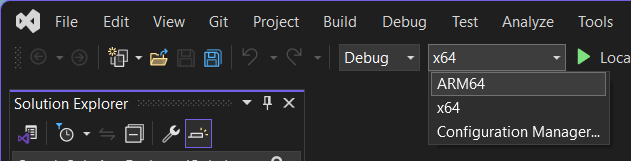

# Windows on Arm Support

Adobe now supports Windows on Arm effect plugins in After Effects, Premiere Pro
and Media Encoder. In order to build a Windows on Arm binary, you will need
Visual Studio 17.4 or greater.

To learn more about adding Windows on Arm support, please visit
[https://learn.microsoft.com/en-us/windows/arm/add-arm-support](https://learn.microsoft.com/en-us/windows/arm/add-arm-support)

---

## How to add Windows on Arm Support for your Plugins

1. Open your plugin's Visual Studio solution in version 17.4 or above and select
   the ARM64 target.

   

   _Visual Studio ARM64 target_

2. Tell Premiere Pro what the main entry point is for Windows on Arm builds.

   > - Find the .r resource file for your plugin.
   > - Add `CodeWinARM64 {"EffectMain"}` next to the existing Intel entry point
   >   definition.
   >
   >   ```cpp
   >   #if defined(PRWIN_ENV)
   >     CodeWinARM64 {"EffectMain"},
   >     CodeWin64X86 {"EffectMain"},
   >   #endif
   >   ```
   >
   > - If for some reason you need different entry points for Intel and Arm,
   >   just provide a different entry point name and string.

3. Compile the Windows on Arm binary by building for the ARM64 target.

Assuming there are no compile time issues with the Windows on Arm build, you can
now use the binary with the Windows on Arm native product.
